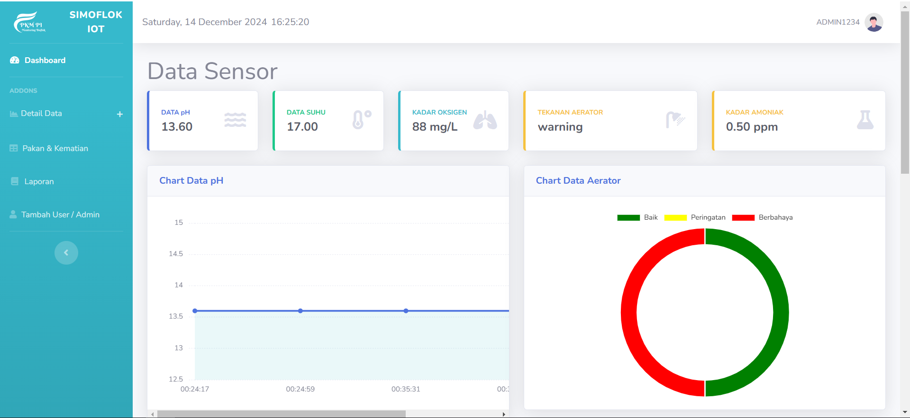

# Simoflok - Website Monitoring IoT for Biofloc Fish Ponds

Simoflok is a web application designed for monitoring IoT devices in biofloc fish ponds. This project helps users track sensor parameters, manage feeding, and monitor fish mortality rates effectively. Built with **HTML**, **CSS**, **PHP**, and the **Bootstrap framework**, Simoflok provides a modern, user-friendly interface with comprehensive functionality for data analysis and management.

---

## Features

### 1. **Dashboard**

- Real-time monitoring of sensor parameters.
- Intuitive visualizations with charts and graphs for better understanding of pond conditions.

### 2. **Detailed Data Page**

- Displays all collected sensor data in a detailed table format.
- Easy-to-navigate interface for reviewing historical records.

### 3. **Feed Management**

- Allows users to add different types of fish feed.
- Track and manage feeding data over time.

### 4. **Mortality Logging**

- Users can input daily fish mortality rates.
- Helps in analyzing trends and taking preventive measures.

### 5. **Reports and Export**

- Generate comprehensive reports in Excel or PDF formats.
- Export specific data as needed for further analysis or record-keeping.

### 6. **Secure Access**

- User verification and CAPTCHA protection for login.
- Admin-only feature to manage user accounts.

---

## Technology Stack

- **Frontend:** HTML, CSS, Bootstrap
- **Backend:** PHP
- **Database:** MySQL
- **Libraries:** Chart.js (or equivalent for graphs and charts)

---

## Installation

1. **Clone the Repository**:

   ```bash
   git clone https://github.com/yourusername/simoflok.git
   cd simoflok
   ```

2. **Set Up Database**:

   - Import the provided SQL file into your MySQL server.
   - Update the database configuration in the `config.php` file.

3. **Configure Web Server**:

   - Place the project folder in your web server directory (e.g., `htdocs` for XAMPP).
   - Start your web server and database.

4. **Access the Application**:

   - Open your browser and go to `http://localhost/simoflok`.

---

## Usage

1. **Login**:

   - Use your credentials to log in (CAPTCHA verification included).
   - Admin can create new users if needed.

2. **Monitor Sensor Parameters**:

   - View real-time data on the dashboard.
   - Analyze trends using dynamic charts.

3. **Manage Feeds and Mortality**:

   - Add new feed types and log mortality rates daily.

4. **Generate Reports**:

   - Export data as Excel or PDF for specific date ranges or parameters.

---

## Screenshots

1. **Dashboard**:
   

2. **Detailed Data Page**:
   
   
3. **Reports**:
   

---

## Future Enhancements

- Integration with more IoT sensors for advanced monitoring.
- AI-based analytics for predictive maintenance and insights.
- Mobile-friendly design for better accessibility.

---

## Contributing

We welcome contributions! Please follow these steps:

1. Fork the repository.
2. Create a new branch for your feature or bug fix.
3. Commit your changes and open a pull request.

---

## License

This project is licensed under the [MIT License](LICENSE).

---

## Contact

For any questions or support, feel free to reach out:

- **Email:** [habibsulaiman816@gmail.com](mailto\:habibsulaiman816@gmail.com)
- **GitHub:** [KacangSoya](https://github.com/KacangSoya)

---

Thank you for using Simoflok! Together, let's make fish pond management smarter and more efficient.

